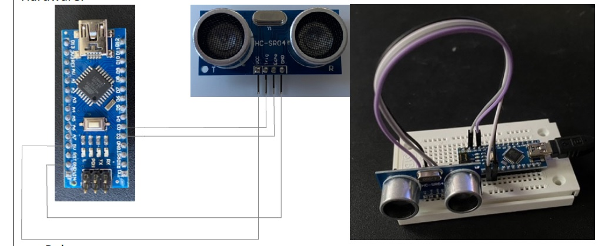
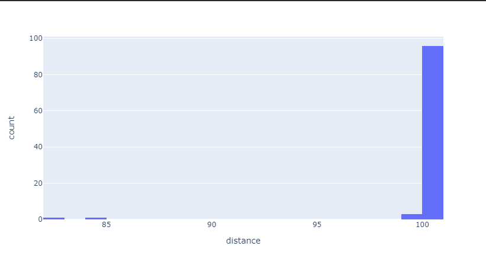
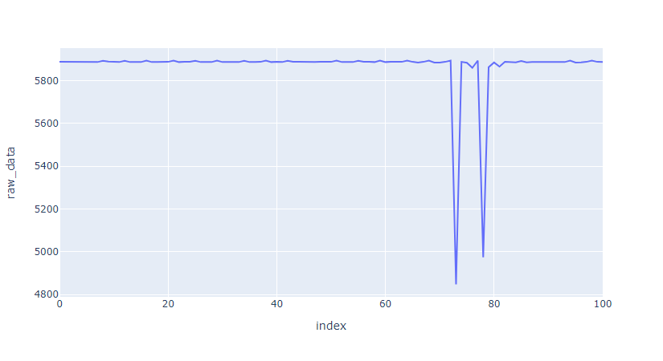
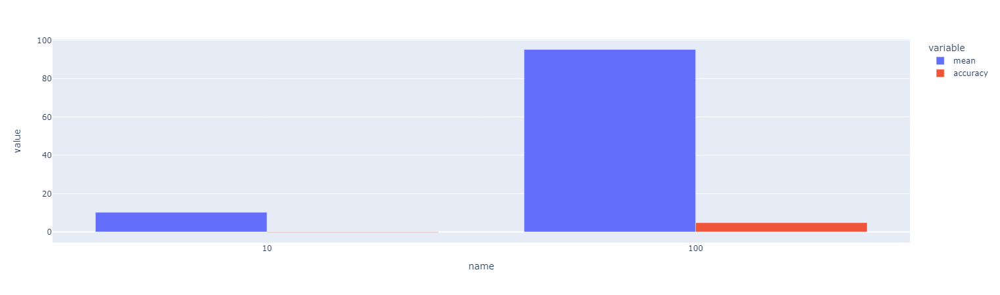

# Function and characteristics of ultrasound-based TOF sensors for distance measurement

## Materials used
- [HC-SR04](https://www.electronicshub.org/hc-sr04-ultrasonic-sensor/) ultrasonic sensor
- [Arduino nano](https://store.arduino.cc/arduino-nano) microcontroller
- [Breadboard](https://www.arduino.cc/en/Tutorial/BuiltInExamples/Breadboard) for prototyping
- [PlatformIO](https://platformio.org/) for code compilation and uploading

## Setup

We use the HC-SR04 ultrasonic sensor to measure the distance between the sensor and an object. The sensor has 4 pins: VCC, GND, Trig and Echo. The VCC and GND pins are used to power the sensor. The Trig pin is used to send a 10us pulse to the sensor to start the measurement. The Echo pin is used to receive the echo signal from the sensor. The echo signal is a pulse that is sent back from the sensor to the microcontroller. The length of the echo signal is proportional to the distance between the sensor and the object. The sensor has a maximum range of 4m.

The following diagram shows the connections between the sensor and the microcontroller.



## Code

The following code is used to measure the distance between the sensor and an object. The code is written in C++ and uses the [Arduino](https://www.arduino.cc/) framework. The code is compiled and uploaded to the microcontroller using [PlatformIO](https://platformio.org/).

```cpp
#include <Arduino.h>

#define ECHO_PIN 2
#define TRIGGER_PIN 3
#define LED_PIN 13

void setup() {
  // put your setup code here, to run once:
  Serial.begin(115200);
  Serial.println("Init");
  pinMode(ECHO_PIN, INPUT);
  pinMode(TRIGGER_PIN, OUTPUT);
  pinMode(LED_PIN, OUTPUT);
}

void loop() {
  // put your main code here, to run repeatedly:
  digitalWrite(TRIGGER_PIN, LOW);
  delayMicroseconds(2);
  digitalWrite(TRIGGER_PIN, HIGH);
  delayMicroseconds(10);
  digitalWrite(TRIGGER_PIN, LOW);
  long microsencondsFlightTime = pulseIn(ECHO_PIN, HIGH);
  Serial.println(microsencondsFlightTime);
  if (microsencondsFlightTime < 2900) {
    digitalWrite(LED_PIN, HIGH);
  } else {
    digitalWrite(LED_PIN, LOW);
  }
}
```

## Results
### Part 1: The sensor

> What happens if the transmission parameters of Arduino and Computer do not match?

The following error is displayed in the serial monitor.


the error is caused by the baud rate mismatch between the Arduino and the computer. The baud rate of the Arduino is 115200 and the baud rate of the computer is 9600. The baud rate of the Arduino can be changed in the code by changing the value of the `Serial.begin()` function. If the values mismatch, the commputer will not be able to read the data from the serial monitor properly.

> What is the maximum Baud-rate?

The maximun baudrate depends on the microcontroller. The Arduino nano can reportedly support a baudrate of higher than 115200 if not using the cap from the arduino IDE. [Source](https://forum.arduino.cc/t/baud-rate-max-absolute/447715/2)

> How is the TOF measurement calculated?

The TOF measurement is calculated by measuring the time it takes for the ultrasonic signal to travel from the sensor to the object and back to the sensor. The time is measured in microseconds. The distance is calculated by multiplying the time by the speed of sound (343m/s) and dividing the result by 2. The result is in meters.

The full procedure involves the following steps:

1. Send a 10us pulse to the sensor to start the measurement.
2. Wait for the echo signal to be received.
3. Measure the time it takes for the echo signal to be received.
4. Calculate the distance by multiplying the time by the speed of sound and dividing the result by 2, in our case we reported back the raw time in microseconds for later processing in the notebook.

> What is the data-flow from the sensor to the Arduino to the Computer?

The data is first capture on the sensor and then sent to the Arduino thru the GPIO pins. The Arduino then sends the data to the computer using the UART to USB converter. We can use the serial monitor or pyserial to read the data from the serial port.

    ┌───────────────────┐  ┌─────────────┐  ┌───────────┐ ┌────┐
    │ Ultrasonic Sensor │  │Arduino Nano │  │UART TO USB│ │PC  │
    │                   │  │             │  │CH340      │ │    │
    │ Trigger Pin ◄─────┼──┘ Digital I/O │  │           │ │    │
    │ Echo Pin──────────┼──► Digital I/O │  │  USB──────┼─┼─►  │
    │                   │  │             │  │           │ │    │
    │                   │  │             │  │           │ │    │
    │                   │  │TX/RX────────┼──┼─►         │ └────┘
    │                   │  │             │  └───────────┘
    └───────────────────┘  └─────────────┘


## Part 2: The interface

In this part the sensor was connected to the oscilloscope with two probes while it was working. One probe to the trigger pin and the other one to the echo pin. The results were recorded and can be seen in the following screenshots.


The blue signal is the TRIG signal and the yellow signal is the ECHO signal. The TRIG signal is a 10us pulse that is sent to the sensor to start the measurement. The ECHO signal is the pulse that is sent back from the sensor to the microcontroller. The length of the ECHO signal is proportional to the distance between the sensor and the object.

> What is the frequency of the ECHO signal?

The frequency of the ECHO signal is around 45 Khz. However the frequency of the ECHO signal is not constant. The frequency of the ECHO signal is proportional to the distance between the sensor and the object. The closer the object is to the sensor, the higher the frequency of the ECHO signal, plus the serialisation of the signal and other factors.


## Part 3: Sensor Characterization

> Setup the sensor with a measurement distance of 100 cm. Take 100 measurements. Create a histogram of the results and calculate the mean value. What does the distribution of measurement values look like?
> Histogram of the results

> Raw Data


## Part 4: Analyze accuracy / resolution / quantization

> What is the accuracy calculated based on the measured data?

> What is the resolution calculated based on the measured data?
> given that the resolution is the smallest difference between two values that can be measured, the resolution is calculated by taking the difference between the minimum and maximum values and dividing the result by the number of measurements. However it wasnt possible to calculate the resolution in this case because the lack of proper measuring tape. 
> What is the quantization calculated based on the measured data?
> Same as  resolution we were not able to calculate the quantization because of the lack of proper measuring tape.
## Part 5: Analyze the influence of the environment

> Modify the program on the Arduino to deliver the distance to the object in cm.

```cpp
void distanceInCentimeters(long microseconds) {
  double speedOfSound = 343.0;
  double distance = (microseconds * speedOfSound) / 2.0;
  return distance / 100.0;
}
```

### Part 6: Analyze the influence of the environment

In this part the fact that ultrasonic sensors are designed to work well for measuring distances from objects that are flat and perpendicular in regards to the sensor was investigated using available objects with non flat surfaces. A bottle of water as an object with a round surface and a square box was used. As it was expected the measurements were as expected when the objects were positioned in front of the sensor without any rotation, i.e. the surface was in 90° i  respect to the sensor transmitting and receiving signals. 
For the square box, at the angle 45°(roughly) the sensor had trouble sensing the correct distance.

### Part 7: Programming a threshold
> Modify the program for the Arduino to switch on LED (13) if an object comes closer than 2m. The LED should switch off again if the distance is larger than 2,10m.
We used 10 cm because the sensor had trouble with longer distances

```cpp
#include <Arduino.h>

#define ECHO_PIN 2
#define TRIGGER_PIN 3
#define LED_PIN 13

void setup() {
  // put your setup code here, to run once:
  Serial.begin(115200);
  Serial.println("Init");
  pinMode(ECHO_PIN, INPUT);
  pinMode(TRIGGER_PIN, OUTPUT);
  pinMode(LED_PIN, OUTPUT);
}

void loop() {
  // put your main code here, to run repeatedly:
  digitalWrite(TRIGGER_PIN, LOW);
  delayMicroseconds(2);
  digitalWrite(TRIGGER_PIN, HIGH);
  delayMicroseconds(10);
  digitalWrite(TRIGGER_PIN, LOW);
  long microsencondsFlightTime = pulseIn(ECHO_PIN, HIGH);
  Serial.println(microsencondsFlightTime);
  if (microsencondsFlightTime < 2900) {
    digitalWrite(LED_PIN, HIGH);
  } else {
    digitalWrite(LED_PIN, LOW);
  }
}
```