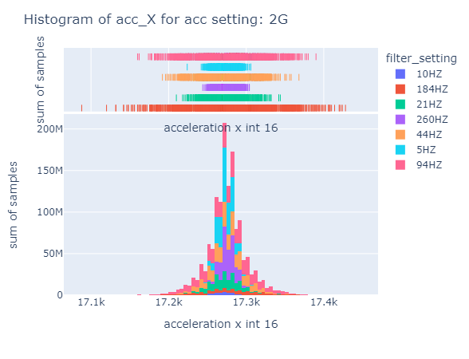

# IE6-BUL  S23

# Function and Characterization ofanInertial SensorCluster/ I2C bus 

Authors: Soodeh Mousaviasl, Celestine Machuca.

Materials used

* [Arduino nano](https://store.arduino.cc/arduino-nano) microcontroller

* [Breadboard](https://www.arduino.cc/en/Tutorial/BuiltInExamples/Breadboard) for prototyping

* [MPU-6050](https://www.invensense.com/products/motion-tracking/6-axis/mpu-6050/) inertial sensor

## Connection diagram

<figure>
  
  <figcaption style="text-align:center; font-style: italic; font-size: smaller;">Fig 1 MPU-6050 connections</figcaption>
</figure>

## Setup Used

<figure>
    
    <figcaption style="text-align:center; font-style: italic; font-size: smaller;">Fig 2 Setup</figcaption>
</figure>

## Lab Tasks

### Part 1 Setup

* Which measurement data is recorded

c code used

```c	
#include <Arduino.h>
#include <Wire.h>

#define sensor_address 0x68

#define FILTER_CONFIG_REG 0x1A

#define SET_FILTER_260HZ 0x06
#define SET_FILTER_184HZ 0x01
#define SET_FILTER_94HZ 0x02
#define SET_FILTER_44HZ 0x03
#define SET_FILTER_21HZ 0x04
#define SET_FILTER_10HZ 0x05
#define SET_FILTER_5HZ 0x06

#define GYRO_CONFIG_REG 0x1B

#define SET_GYRO_250 0x00
#define SET_GYRO_500 0x08
#define SET_GYRO_1000 0x10
#define SET_GYRO_2000 0x18

#define ACC_CONFIG_REG 0x1C

#define SET_ACC_2G 0x00
#define SET_ACC_4G 0x08
#define SET_ACC_8G 0x10
#define SET_ACC_16G 0x18

void SetConfiguration(byte reg, byte setting)
{
  // Aufruf des MPU6050 Sensor
  Wire.beginTransmission(sensor_address);
  // Register Aufruf
  Wire.write(reg);
  // Einstellungsbyte für das Register senden
  Wire.write(setting);
  Wire.endTransmission();
}

void setupIMU(){

}
void setup()
{
  // ggf. Übertragungsrate anpassen
  Serial.begin(115200);
  Wire.begin();
  delay(1000);

  // Powermanagement aufrufen
  // Sensor schlafen und Reset, Clock wird zunächst von Gyro-Achse Z verwendet
  // Serial.println("Powermanagement aufrufen - Reset");
  SetConfiguration(0x6B, 0x80);

  // Kurz warten
  delay(500);

  // Powermanagement aufrufen
  // Sleep beenden und Clock von Gyroskopeachse X verwenden
  // Serial.println("Powermanagement aufrufen - Clock festlegen");
  SetConfiguration(0x6B, 0x03);

  delay(500);
  // filter configuration
  SetConfiguration(FILTER_CONFIG_REG, SET_FILTER_94HZ);
  // gyro config
  SetConfiguration(GYRO_CONFIG_REG, SET_GYRO_1000);
  // acc config
  SetConfiguration(ACC_CONFIG_REG, SET_ACC_8G);
  delay(500);
}

void loop()
{
  byte result[14];
  result[0] = 0x3B;
  Wire.beginTransmission(sensor_address);
  Wire.write(result[0]);
  Wire.endTransmission();
  Wire.requestFrom(sensor_address, 14);
  for (int i = 0; i < 14; i++)
  {
    result[i] = Wire.read();
  }


  int16_t acc_X = (((int16_t)result[0]) << 8) | result[1];
  int16_t acc_Y = (((int16_t)result[2]) << 8) | result[3];
  int16_t acc_Z = (((int16_t)result[4]) << 8) | result[5];

  // Temperature sensor
  int16_t temp = (((int16_t)result[6]) << 8) | result[7];
  int16_t tempC = temp / 340 + 36.53;

  // Gyroscope
  int16_t gyr_X = (((int16_t)result[8]) << 8) | result[9];
  int16_t gyr_Y = (((int16_t)result[10]) << 8) | result[11];
  int16_t gyr_Z = (((int16_t)result[12]) << 8) | result[13];
  // Print data
  //json like format
  Serial.print("{\"acc_X\":");
  Serial.print(acc_X);
  Serial.print(",\"acc_Y\":");
  Serial.print(acc_Y);
  Serial.print(",\"acc_Z\":");
  Serial.print(acc_Z);
  Serial.print(",\"temp\":");
  Serial.print(temp);
  Serial.print(",\"tempC\":");
  Serial.print(tempC);
  Serial.print(",\"gyr_X\":");
  Serial.print(gyr_X);
  Serial.print(",\"gyr_Y\":");
  Serial.print(gyr_Y);
  Serial.print(",\"gyr_Z\":");
  Serial.print(gyr_Z);
  Serial.println("}");
}

```

From the code the data being recorded is:

```c	
// Accelerometer
int16_t acc_X = (((int16_t)result[0]) << 8) | result[1];
int16_t acc_Y = (((int16_t)result[2]) << 8) | result[3];
int16_t acc_Z = (((int16_t)result[4]) << 8) | result[5];

// Temperature sensor
int16_t temp = (((int16_t)result[6]) << 8) | result[7];
int16_t tempC = temp / 340 + 36.53;

// Gyroscope
int16_t gyr_X = (((int16_t)result[8]) << 8) | result[9];
int16_t gyr_Y = (((int16_t)result[10]) << 8) | result[11];
int16_t gyr_Z = (((int16_t)result[12]) << 8) | result[13];
```

Example output:

```
{"acc_X":4210,"acc_Y":15,"acc_Z":-1416,"temp":-4341,"tempC":24,"gyr_X":-83,"gyr_Y":-34,"gyr_Z":36}
{"acc_X":4212,"acc_Y":-2,"acc_Z":-1401,"temp":-4312,"tempC":24,"gyr_X":-85,"gyr_Y":-34,"gyr_Z":38}
{"acc_X":4214,"acc_Y":-4,"acc_Z":-1416,"temp":-4335,"tempC":24,"gyr_X":-85,"gyr_Y":-37,"gyr_Z":34}
{"acc_X":4207,"acc_Y":7,"acc_Z":-1409,"temp":-4332,"tempC":24,"gyr_X":-88,"gyr_Y":-37,"gyr_Z":33}
{"acc_X":4194,"acc_Y":1,"acc_Z":-1385,"temp":-4331,"tempC":24,"gyr_X":-84,"gyr_Y":-36,"gyr_Z":34}
{"acc_X":4216,"acc_Y":13,"acc_Z":-1412,"temp":-4332,"tempC":24,"gyr_X":-87,"gyr_Y":-37,"gyr_Z":33}
{"acc_X":4208,"acc_Y":15,"acc_Z":-1405,"temp":-4330,"tempC":24,"gyr_X":-90,"gyr_Y":-37,"gyr_Z":35}
{"acc_X":4209,"acc_Y":7,"acc_Z":-1389,"temp":-4343,"tempC":24,"gyr_X":-91,"gyr_Y":-40,"gyr_Z":34}
{"acc_X":4211,"acc_Y":10,"acc_Z":-1393,"temp":-4332,"tempC":24,"gyr_X":-88,"gyr_Y":-35,"gyr_Z":33}
{"acc_X":4194,"acc_Y":-1,"acc_Z":-1399,"temp":-4331,"tempC":24,"gyr_X":-86,"gyr_Y":-38,"gyr_Z":35}
```

* how does the measurement data get to the laptop?

<figure>
    
    <figcaption style="text-align:center; font-style: italic; font-size: smaller;">Fig 3 Flow Chart</figcaption>
</figure>

The MPU6050 sends data from its gyro, accelerometer, and temperature sensor to the Arduino via the I2C bus.
The Arduino processes the received data and formats it for transmission.
The Arduino sends the formatted data to the laptop via a USB cable using serial communication.
A serial terminal or custom software on the laptop reads and interprets the received data, allowing you to view and analyze the measurements.

### Part 2 Configuration 

* Find out how to set the sensor cluster to different bandwidths and measurement ranges by analyzing the data sheet?

Using the datasheet, the sensor cluster can be set to different bandwidth and measurements through modifying the values of specific registers in the MPU-6050’s register map. 
The 0x1A register – CONFIG – is used to configure the DLPF (Digital Low-Pass Filter) and the sampling rate divider (SMPLRT_DIV). The 0x1B register - GYRO_CONFIG – is for configuring the Gyroscope’s full-scale range. And the 0x1C register - ACCEL_CONFIG – is for configuring the full-scale range of the accelerometer. 
Hence, to set different bandwidth the DLPF_CFG bits of 0x1A register were modified based on the availble options (look datasheet register map page 13).
On Page 29 to 31 of the MPU6050 register map, there is a table that shows the different configurations for the accelerometer and gyroscope. The table shows the different bandwidths and measurement range and the corresponding register values.

Page 29 Registers 59 to 64 – Accelerometer Measurements

<figure>
    
    <figcaption style="text-align:center; font-style: italic; font-size: smaller;">Fig 4 Accelerometer</figcaption>
</figure>

<figure>
    
    <figcaption style="text-align:center; font-style: italic; font-size: smaller;">Fig 5 Accelerometer Bandwidth</figcaption>
</figure>

<figure>
    
    <figcaption style="text-align:center; font-style: italic; font-size: smaller;">Fig 6 Accelerometer Parameters</figcaption>
</figure>

Page 29 Registers 65 to 66 – Temperature Measurements

<figure>
    
    <figcaption style="text-align:center; font-style: italic; font-size: smaller;">Fig 7 Temperature</figcaption>
</figure>

<figure>
    
    <figcaption style="text-align:center; font-style: italic; font-size: smaller;">Fig 8 Temperature Parameters</figcaption>
</figure>

Using the datasheet, the sensor cluster can be set to different bandwidth and measurements through modifying the values of specific registers in the MPU-6050’s register map. 
The 0x1A register – CONFIG – is used to configure the DLPF (Digital Low-Pass Filter) and the sampling rate divider (SMPLRT_DIV). The 0x1B register - GYRO_CONFIG – is for configuring the Gyroscope’s full-scale range. And the 0x1C register - ACCEL_CONFIG – is for configuring the full-scale range of the accelerometer. 
Hence, to set different bandwidth the DLPF_CFG bits of 0x1A register were modified based on the availble options (look datasheet register map page 13).

Page 30 Registers 67 to 72 – Gyroscope Measurements
<figure>
    
    <figcaption style="text-align:center; font-style: italic; font-size: smaller;">Fig 7 Gyroscope</figcaption>
</figure>

<figure>
    
    <figcaption style="text-align:center; font-style: italic; font-size: smaller;">Fig 8 Gyroscope Bandwidth</figcaption>
</figure>

<figure>
    
    <figcaption style="text-align:center; font-style: italic; font-size: smaller;">Fig 9 Gyroscope Parameters</figcaption>
</figure>

* Try out different configurations for the measuring range of one channel of the accelerometer and measure the digital output values for a = -1 g; 0 ; +1 g.

We performed the test over this values = +-2g, +-4g,+-8g, +-16h against earth gravity on the X Accelerometer. The results are shown below.

<figure>
    
    <figcaption style="text-align:center; font-style: italic; font-size: smaller;">Fig 10 Accelerometer Results</figcaption>
</figure>

* What is the resolution of each of these measurements?
In theory a the int 2^{16} = 65536 different values can be measured. The range of the accelerometer is -2g to +2gs as 2 complements is used.

The resolution is 4g/65536 = 0.000061 g


### Part 3 Oscilloscope measurements on the I2C bus

* Connect the oscilloscope to your measurement setup. Measure the voltage between SCL and GND with a probe (please adjust the square-wave signal first!) and examine the data line SDA with a second probe.

* Compare your measurement result with the I2C data protocol from the lecture (or e.g. from https://de.wikipedia.org/wiki/I²C).

* Please answer the following questions in your lab report:What is the datarate? How many bits (raw) are transferred per second?Analyze a single I2C telegram based on your oscilloscope measurement.How does your measurement compare tothe physical layer of the ideal I2C?

### Part 4 Measuring Noise on a acceleration sensor

* Analyze the noise performance of one of the three axes of the accelerometer for different bandwidths (e.g. 260 Hz vs. 5 Hz)

* To do this, keep the sensor vibration-free/still and carry out a long-term measurement, e.g. over 1000 values. Check the measurement in the time domain for outliers, filter them out if necessary,using a suitable filter(either on the Arduino or on your computer).Document the filter and include source code and explanation into your report.

* Create and compare the histograms for at least two different bandwidths and, if applicable, with or w/o filter. What are the reasons for the differences?


<figure>
    
    <figcaption style="text-align:center; font-style: italic; font-size: smaller;">Fig 11 Histogram Acceleration X 2g Different Filters</figcaption>
</figure>

<figure>
    
    <figcaption style="text-align:center; font-style: italic; font-size: smaller;">Fig 12 Histogram Acceleration X 4g Different Filters</figcaption>
</figure>

<figure>
    
    <figcaption style="text-align:center; font-style: italic; font-size: smaller;">Fig 13 Histogram Acceleration X 8g Different Filters</figcaption>
</figure>

<figure>
    
    <figcaption style="text-align:center; font-style: italic; font-size: smaller;">Fig 14 Histogram Acceleration X 16g Different Filters</figcaption>
</figure>


### Part 5 Determination of the noise behavior of a channel of the angular rate sensor -->

* Analyze the noise behavior of one of the three axes of the angular rate sensor for different bandwidths (e.g. 260 Hz vs. 5 Hz).

* To do this, keep the sensor vibration-free/still and carry out a long-term measurement, e.g. over 1000 values. Check the measurement in the time domain for outliers, filter them out if necessary,using a suitable filter in the Arduinoor on your PC.Document the filter and include source code and explanation into your report.

* Create and compare the histograms for at least two different bandwidths and, if applicable, with or w/o filter. What are the reasons for the differences?

* How large is the offset of the yaw rate signal in the respective measurements?

<figure>
    
    <figcaption style="text-align:center; font-style: italic; font-size: smaller;">Fig 15 Histogram Gyroscope X 250dps Different Filters</figcaption>
</figure>

### Part 6 Visualization with “Processing”

* Switch the setupto evaluating the data with Processing –for this you need the program „ArduinoProcessingMPU6050“ on the Arduino and „ProcessingMPU6050“withinProcessing

* Analyze the program for the Arduino. How does it work? How do you find out the correction values that need to be entered into the program?

* Analyzethe program for Processing. What does this program do? How does it work?

* Try itout: Move the sensor and watch the screen. How do you know that your sensor is not yet perfectly calibrated?

* Document your results with a screendump in your lab report.
